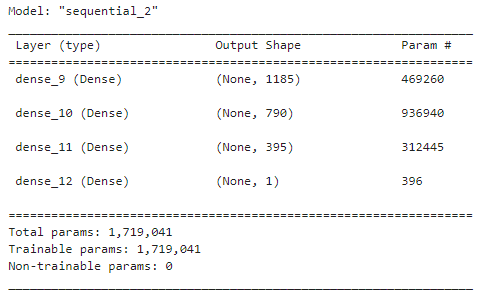

# Neural_Network_Charity_Analysis

## Overview
With machine learning and neural networks, use the features in the provided dataset to create a binary classifier that is capable of predicting whether applicants will be successful if funded by Alphabet Soup.

## Results

### Data Preprocessing - Final Model (Attempt #3)
- Target variable: IS_SUCCESSFUL
- Feature variables: 
  - NAME (binned values less than or equal to 5)
  - APPLICATION_TYPE (binned values less than 200)
  - AFFILIATION
  - CLASSIFICATION (binned values less than 1000)
  - USE_CASE
  - ORGANIZATION
  - INCOME_AMT
- Removed variables:
  - EIN
  - STATUS
  - SPECIAL_CONSIDERATIONS
### Compiling, Training, and Evaluating the Model
#### Neural Network Model - Final Model (Attempt #3)

  - Neurons
    - 1st hidden layer: number_input_features * 3 = 1185  
    - 2nd hidden layer: number_input_features * 2 = 790
    - 3rd hidden layer: number_input_features * 1 = 395
    - Total: 2370
  - Layers
    - 3 hidden layers
    - 1 output layer
  - Activation Function
    - 3 hidden layers: ReLU
    - 1 output laye: Sigmoid  

- Able to achieve target model accuracy at 0.788
- Increased model performance by:
  - Removing variables that had too many or too few unique terms in them. 
  - Binning variables in a way that improved optimization.
  - Adjusting the amount of layers and neurons and the type of activation functions in the model.
   
## Summary
The results of this model are good, but could be better. A different model with different variables could solve the classification problem because it could be that the inclusion of so many variables is causing the model to be inaccurate. The model can also be adjusted with different amounts of layers and neurons and different activation functions. In particular, the number of neurons can be determined according to general rules, such as the number of neurons being 2/3 the size of the input layer, plus the size of the output layer and less than twice the size of the input layer.
